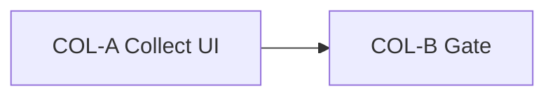

# COD Collected Ops COL — BR-PAY-04 V1 Mark Collected UI

**Status:** DONE (2026-08-29) — COL-A…B accepted; focused **8 / 44**; AR/EN **1155 / 1155**  
**Authority:** ADR-001, ADR-002, ADR-005, ADR-012, **ADR-042**; BR-PAY-03, **BR-PAY-04**, BR-VO-02, BR-VO-03, BR-CAN / BR-REF-02 (cancel side); FR-RBAC-04  
**Baseline:** Checkout CHK DONE — one COD `Payment` per Vendor Order; VOL/CAN unchanged; **COL-A…B** — staff/vendor **Mark collected** on delivered VOs live at admin payment show + vendor order show  
**Related:** Closes the deferred **COD collected mutation UI** called out in VOL, CAN, ADM, HND, and ADDR hard boundaries. **Does not** close BR-PAY-05 physical collector/settlement narrative (software auth only).

Implement only the named slice when asked. Do **not** start card charge (F1), settlement/refund ledger (F2), SMS (F7), admin cancel, payment-only cancel UI, auto-collect on deliver, collected reversal, Parent derivation, demo seeder redesign, or checkout changes unless a later approved slice says so.

## Planning freeze (APPROVED for COL V1)

| Topic | Decision for COL V1 | Notes |
|-------|----------------------|--------|
| Status grain | **One Payment per Vendor Order** (BR-PAY-03 / ADR-042) | No Parent-level payment row; no multi-VO bulk collect in V1. |
| Status set | `pending` \| `collected` \| `cancelled` (BR-PAY-04) | COL adds **`pending → collected`** only. |
| Collect precondition | Payment **method = COD**, status **`pending`**, linked VO status **`delivered`** | Aligns with fulfillment-complete COD handoff; no collect while VO still in flight. |
| Collect effect | Set `status = collected`, `collected_at = now()` (UTC app time) | Transactional `lockForUpdate` on payment row; idempotent reject if not `pending`. |
| Who may collect | **Staff** (any payment) **or owning vendor** (payment’s VO only) | V1 software auth freeze for BR-PAY-05 gap — both actors may mark collected; customers **never**; stranger → **404**. |
| Cancelled transitions | **No new COL cancel UI** | `pending → cancelled` stays in **`OrderCancellationService`** (CAN matrix) only. Never mutate `collected`; never payment-only cancel bypass. |
| Surfaces | **Mark collected** action on staff payment show + vendor VO show (when allowed) | Read-only index/list unchanged except status labels after collect. Optional deep-link from admin VO show to payment show with action. |
| Gateway / service | Extend `PaymentGateway` + `CodPaymentGateway` with `markCollected(Payment): Payment` **or** thin `PaymentCollectionService` delegating to gateway | Match `docs/architecture.md` §13; checkout `chargeVendorOrder()` unchanged. |
| Policy | Add `collect` on `PaymentPolicy` (or equivalent) — staff **or** owning vendor when preconditions met | Keep `create`/`update`/`delete` false; do not expose generic payment update. |
| Notifications | **Out** | No mail/database on collect in COL V1 (add in a later slice if needed). |
| KPI / reporting | Existing admin dashboard counts by status — **no change** beyond live data | After collect, `pending` count decreases and `collected` increases via existing `AdminDashboardStatsService`. |
| i18n | AR/EN key parity for new UI strings | Arabic default RTL; English LTR complete. |
| Storage | MySQL authoritative | No new migrations unless schema bug found (`collected_at` already exists). |

### Source rules

> 1. COD payment statuses are `pending`, `collected`, `cancelled` (BR-PAY-04 / ADR-042).  
> 2. One Payment record per Vendor Order (BR-PAY-03).  
> 3. Vendors access only their Vendor Orders / related payments (BR-VO-02 / FR-RBAC-04).  
> 4. Cancellation sets pending payment to `cancelled` and **never mutates `collected`** (CAN freeze / BR-REF-02 direction).  
> 5. Commission recognition on `delivered` is unchanged — collect does **not** recompute commission or totals.

### Hard out of scope (every slice)

- Card charge / wallet gateways (F1)  
- Settlement, refund, or vendor wallet ledger (F2)  
- SMS or new notification channels (F7)  
- Auto-collect when VO reaches `delivered` (explicitly out of VOL; manual mark only)  
- `collected → pending` reversal; `collected → cancelled` mutation  
- Payment-only cancel UI; admin Parent/VO cancel (still CAN / future)  
- Parent Order status derivation (BR-VO-05)  
- Customer-initiated collect  
- Bulk / batch collect across VOs  
- Checkout, cart, coupon, or shipping recalculation changes  
- `DemoMarketplaceSeeder` redesign  
- Redis; Horizon  

## Slice map

| Slice | Primary outcome | Depends on | Status |
|-------|-----------------|------------|--------|
| **COL-A** | Collect service + policy + staff/vendor POST routes + Blade actions + focused HTTP/domain tests | This freeze | **DONE** (2026-08-29) — focused **8 / 44** |
| **COL-B** | Small gate: Pint; `view:cache`; AR/EN parity; forbidden-ref; mark DONE | COL-A | **DONE** (2026-08-29) |



---

## COL-A — Mark collected behavior + focused tests

**Status:** DONE (2026-08-29) — focused **8 / 44**; CAN collected guard **1 / 4**; VOL deliver pending **1 / 17**; ADM updated **3 / 86** + smoke **1 / 9**

**Goal:** Authorized staff and owning vendors can mark a **delivered** Vendor Order’s **pending** COD payment as **collected**; cancelled/collected guards remain intact.

**In scope**

1. **Domain collect** — `markCollected(Payment $payment): Payment` on gateway or dedicated service: lock payment; assert COD + `pending`; assert linked VO `delivered`; set `collected` + `collected_at`; throw typed domain exception on illegal state (match CAN/VOL patterns).  
2. **Contract** — Add `markCollected` to `PaymentGateway`; implement in `CodPaymentGateway`; bind unchanged in service provider.  
3. **Policy** — `PaymentPolicy::collect(User, Payment): bool` — staff **or** owning vendor when preconditions satisfied; else false → **404** on HTTP routes.  
4. **Routes** (auth middleware):  
   - `POST /admin/payments/{payment}/collect` → `admin.payments.collect` (staff)  
   - `POST /vendor/orders/{vendorOrder}/collect-payment` → `vendor.orders.collect-payment` (vendor; resolve payment via VO)  
5. **Controllers** — Thin `Admin\PaymentController@collect` + `Vendor\VendorOrderController@collectPayment` (or dedicated action methods); Form Request optional if empty body; authorize `collect`.  
6. **Views** —  
   - `admin/payments/show.blade.php` — “Mark collected” when allowed; show `collected_at` when collected (reuse `OrderViewService` labels).  
   - `vendor/orders/show.blade.php` — same affordance when VO delivered + payment pending.  
   - Hide action when preconditions fail (no disabled tease that leaks foreign IDs).  
7. **Focused HTTP tests** (`CodCollectedOpsColATest` or split):  
   - Staff collect happy path (delivered VO + pending payment)  
   - Vendor collect own VO happy path  
   - Reject when VO not `delivered` (`confirmed` / `shipped` / `cancelled`)  
   - Reject when payment already `collected` or `cancelled`  
   - Stranger / foreign vendor → **404**  
   - Guest redirected  
   - **Regression:** collected payment still blocks cancel (`OrderCancellationCanATest` / `CanBTest` spot-check or one case)  
   - **Regression:** deliver transition still leaves payment `pending` until manual collect (VOL spot-check)  
   - Update/replace ADM assertions that expect **no** “Mark collected” — use fixture where action **should** appear vs stay hidden  
8. **AR/EN** strings for button, flash success, and illegal-state messages.

**Out of scope:** COL-B gate; notifications; settlement; admin cancel; full Docker suite.

**Done when:** Focused COL-A HTTP/domain tests green; collect UI visible only when allowed; CAN/VOL regressions still pass for included spot-checks.

**Stop after COL-A.** (Completed.)

---

## COL-B — Acceptance gate

**Status:** DONE (2026-08-29)  

**Goal:** COL V1 accepted; COD `pending → collected` operational for staff and vendors; forbidden surfaces unchanged.

**In scope**

1. Gate: focused COL tests (A); Pint (COL-scoped); `view:cache`; AR/EN parity (`scripts/lang-parity.php`); **forbidden-ref** — no card charge, settlement ledger, SMS, auto-collect on deliver, admin cancel, payment-only cancel, checkout changes, demo seeder redesign on COL-touched surfaces.  
2. Mark this task DONE with exact counts; optional one-line note in `docs/development-plan.md` (BR-PAY-04 collect UI live).

**Out of scope:** Full Docker suite unless project gate requires it — prefer focused COL + parity (match ADDR-B / WSH-C).

**Done when:** Gate table recorded; task DONE.

### Gate (COL-B / COL final)

| Check | Result |
|-------|--------|
| Focused COL (`CodCollectedOpsColATest`) | **8 / 44** |
| Pint (COL-scoped PHP: gateway, exception, policy, controllers, routes, tests) | **PASS** |
| `view:cache` | **PASS** |
| AR/EN key parity | **1155 / 1155** (missing 0) |
| Forbidden-ref (card charge; settlement ledger; SMS; auto-collect on deliver; admin cancel; payment-only cancel; checkout changes; demo seeder redesign — COL surfaces) | **PASS** |
| Full Docker PHPUnit | **Not run** (per slice — focused COL + parity only) |
| Gate leftovers | **0** |

**Verification (COL-B):** Task **DONE**. BR-PAY-04 COD mark-collected UI live for staff and owning vendors on delivered VOs. Cancel stays CAN-only; F1/F2/F7 remain out.

**Stop after COL-B.** (Completed.)

---

## Hard boundaries (every slice)

- Collect only `pending` COD on **`delivered`** VOs; staff or owning vendor only; stranger **404**.  
- Never mutate `collected`; cancel stays CAN-only.  
- No checkout, commission, shipping, or inventory side effects on collect.  
- No card charge; settlement ledger; SMS; F1/F2/F7.  
- No commit/push unless the user asks.

## Existing code anchors (inspect before COL-A)

| Area | Location |
|------|----------|
| Enum | `app/Enums/PaymentStatus.php` |
| Model | `app/Models/Payment.php` |
| Gateway | `app/Contracts/PaymentGateway.php`, `app/Payments/CodPaymentGateway.php` |
| Policy | `app/Policies/PaymentPolicy.php` (all mutations currently `false`) |
| Cancel guard | `app/Services/OrderCancellationService.php` — `cancelPendingPayment()` |
| Admin read UI | `app/Http/Controllers/Admin/PaymentController.php`, `resources/views/admin/payments/show.blade.php` |
| Vendor read UI | `app/Http/Controllers/Vendor/VendorOrderController.php`, `resources/views/vendor/orders/show.blade.php` |
| Presenters | `app/Services/OrderViewService.php` — `paymentStatusLabel()`, `adminPaymentDetail()` |
| KPI counts | `app/Services/AdminDashboardStatsService.php` |
| ADM “no collect” tests | `tests/Feature/AdminOpsAdmCTest.php`, `AdminOpsAdmDSmokeTest.php` |
| Cancel collected guard | `tests/Feature/OrderCancellationCanATest.php` |
| VOL payment unchanged | `tests/Feature/VendorOrderLifecycleVolATest.php` |
| Architecture note | `docs/architecture.md` §13 — `markCollected(...)` on interface |

## Prompts

```text
Implement only COL-A from @docs/tasks/cod-collected-ops-col.md. Stop after focused COL-A HTTP tests.
```

```text
Implement only COL-B from @docs/tasks/cod-collected-ops-col.md. Stop after the final acceptance report.
```
