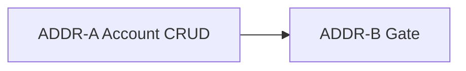

# Customer Address Book ADDR — BR-CUS-02 V1 Account CRUD

**Status:** DONE (2026-08-29) — ADDR-A…B accepted; focused **8 / 48**; checkout inline create **1 / 9**; AR/EN **1152 / 1152**  
**Authority:** ADR-001, ADR-002, ADR-012, ADR-042; BR-CUS-02, BR-CUS-06, BR-GEO-02, BR-GEO-03, BR-GEO-05, BR-CHK-06; FR-RBAC-04  
**Baseline:** Checkout CHK DONE — `customer_addresses` table, `CustomerAddress` model, `CustomerAddressPolicy`, checkout inline create via `PlaceCheckoutOrderRequest::resolveAddress()`; account address book CRUD live at `/account/addresses` (ADDR-A…B)  
**Related:** Fills BR-CUS-02 account surface; **does not** change checkout/order placement behavior beyond shared validation extraction

Implement only the named slice when asked. Do **not** start card charge, COD collected UI, settlement ledger, SMS, advanced shipping (F4), admin address UI, maps/geo picker productization, demo seeder redesign, or checkout UX changes unless a later approved slice says so.

## Planning freeze (APPROVED for ADDR V1)

| Topic | Decision for ADDR V1 | Notes |
|-------|----------------------|--------|
| Audience | **Authenticated customers only** on account routes | Guests → login redirect (existing `auth` middleware). Vendors/staff without customer use → **404** on account address book (no admin address UI). |
| Ownership | Customer manages **own** `CustomerAddress` rows only | Reuse/tighten `CustomerAddressPolicy`; stranger or foreign row on show/edit/delete/set-default → **404** (fail-closed, match Wishlist/Orders). |
| Fields | Same as checkout new-address payload | `label`, `recipient_name`, `phone`, `governorate_id`, `city_id`, `line1`, `line2`, `notes`, `is_default` — schema already exists; **no** `area_id` (BR-GEO-03 out). |
| Geo | Syria governorates + cities only | Reuse active SY governorate + city `exists` rules and city∈governorate `after` validation from `PlaceCheckoutOrderRequest`. |
| Default | **One default per user** | When setting/creating default, clear other `is_default` for that user in a transaction (same semantics as checkout `resolveAddress()`). First address for user may auto-default if checkbox omitted (match checkout). |
| Surfaces | Account **list + create + edit + delete + set default** at `/account/addresses` | Replace `Route::view` placeholder; keep route name `account.addresses` for index; add named routes for create/store/edit/update/destroy/set-default. |
| Validation reuse | Extract shared rules (trait/concern on Form Request or dedicated rules class) + thin service/helper for default clearing | `PlaceCheckoutOrderRequest` refactors to **use shared field rules only** — no checkout flow/Blade/order changes. |
| Stale copy | Remove placeholder strings from `account/addresses.blade.php` and dashboard address card | Drop “later phase” / “commerce phase” / “deferred until shipping” address copy; replace with live UI. ADDR-B verifies keys removed if unused. |
| i18n | AR/EN key parity for all new strings | Arabic default RTL; English LTR complete. |
| Maps / area | **Out** | No map widgets; no area/neighborhood level (BR-GEO-03). |
| Checkout | **No behavioral change** | Existing select-existing / create-new at checkout continues to work; may call shared validation/default helper after extraction. |
| Storage | MySQL authoritative | No Redis; no new migrations unless a bug is found (schema sufficient). |

### Source rules

> 1. Customers may maintain shipping addresses (BR-CUS-02).  
> 2. Customers access only their own addresses (BR-CUS-06 / FR-RBAC-04).  
> 3. Syria governorate+city only; no area level in V1 (BR-GEO-02 / BR-GEO-03 / BR-GEO-05 / ADR-042).  
> 4. Parent order address snapshot at placement is unchanged (BR-CHK-06) — editing book does not mutate past orders.

### Hard out of scope (every slice)

- Maps, geocoding, GPS, third-party address APIs  
- Area/neighborhood level (BR-GEO-03)  
- Admin/staff address management UI  
- Checkout Blade/flow changes (beyond shared validation extraction)  
- Order/payment/shipping recalculation  
- Card charge; COD collected mutation; settlement ledger; SMS  
- Advanced shipping rules (Future F4)  
- `DemoMarketplaceSeeder` redesign  
- Guest address book  

## Slice map

| Slice | Primary outcome | Depends on | Status |
|-------|-----------------|------------|--------|
| **ADDR-A** | Account CRUD UI + shared validation extraction + HTTP tests; remove address placeholder copy | This freeze | **DONE** (2026-08-29) — focused **8 / 48** |
| **ADDR-B** | Small gate: focused tests; AR/EN parity; stale-string check; mark DONE | ADDR-A | **DONE** (2026-08-29) |



---

## ADDR-A — Account address book CRUD

**Status:** DONE (2026-08-29) — focused **8 / 48**; checkout inline create regression **1 / 9**  

**Goal:** Authenticated customers can manage their Syria delivery addresses from the account area using the same field contract as checkout.

**In scope**

1. **Shared validation** — Extract address field rules + city∈governorate check from `PlaceCheckoutOrderRequest` into a reusable concern/class; refactor checkout request to consume it without changing checkout behavior.  
2. **Default helper/service** — Thin transactional helper to clear/set `is_default` (reuse from checkout `resolveAddress()` logic).  
3. **Policy** — Account mutations owner-only; account index `viewAny` for **customers** on account routes (staff may retain model policy for future but **no** staff UI); foreign/stranger → **404**.  
4. **Routes** (auth group) — replace `Route::view('/account/addresses', …)` with controller routes, e.g.:  
   - `GET /account/addresses` → index (`account.addresses`)  
   - `GET /account/addresses/create` → create (`account.addresses.create`)  
   - `POST /account/addresses` → store (`account.addresses.store`)  
   - `GET /account/addresses/{customerAddress}/edit` → edit (`account.addresses.edit`)  
   - `PUT/PATCH /account/addresses/{customerAddress}` → update (`account.addresses.update`)  
   - `DELETE /account/addresses/{customerAddress}` → destroy (`account.addresses.destroy`)  
   - `POST /account/addresses/{customerAddress}/default` → set default (`account.addresses.default`)  
5. **Controller** — `Account\CustomerAddressController` (thin); Form Requests for store/update/destroy/set-default; authorize via policy.  
6. **Views** — Replace `resources/views/account/addresses.blade.php` placeholder with list (default badge, actions), shared form partial (governorate/city selects aligned with checkout — load active SY geo), create/edit pages or modal pattern consistent with account shell.  
7. **Dashboard** — Update address card in `resources/views/dashboard.blade.php`: remove “commerce phase” copy; show count or “Manage addresses” CTA (query-free or bounded count).  
8. **Focused HTTP tests** (`CustomerAddressAddrATest` or split if needed):  
   - Guest redirected from index/mutate  
   - Customer CRUD happy path  
   - Set default clears previous default  
   - City/governorate mismatch rejected  
   - Stranger show/edit/delete/default → **404**  
   - Inactive geo rejected  
   - Checkout regression spot-check: existing `CheckoutChkDUiTest` inline create still passes (run focused checkout test or include one case)  
9. **AR/EN** strings for new UI; remove Blade references to stale placeholder keys listed in ADDR-B.

**Out of scope:** ADDR-B gate; admin UI; maps; migrations (unless constraint bug); checkout Blade redesign; full Docker suite.

**Done when:** Focused ADDR-A HTTP tests green; placeholder address copy removed from account + dashboard; shared validation extracted; checkout tests still pass for inline address create.

**Stop after ADDR-A.** (Completed.)

---

## ADDR-B — Acceptance gate

**Status:** DONE (2026-08-29)  

**Goal:** ADDR V1 accepted; account address book replaces placeholders; stale strings verified gone.

**In scope**

1. Gate: focused ADDR tests (A); Pint (ADDR-scoped); `view:cache`; AR/EN parity; **stale-string check** — no remaining Blade/dashboard use of:  
   - `Delivery addresses will be managed here in a later phase.`  
   - `Address forms and maps are deferred until shipping is implemented.`  
   - `Shipping addresses wait for the commerce phase.`  
   (Remove orphaned lang keys if nothing else references them.)  
2. Forbidden-ref: no card charge, settlement, COD collect UI, admin address UI, maps, area level, checkout flow changes, demo seeder redesign.  
3. Mark this task DONE with exact counts; optional one-line note in `docs/development-plan.md` (BR-CUS-02 account addresses live).

**Out of scope:** Full Docker suite unless project gate requires it — prefer focused ADDR + parity (match WSH-C / HND-C lightly).

**Done when:** Gate table recorded; stale address placeholder strings **0**; task DONE.

### Gate (ADDR-B / ADDR final)

| Check | Result |
|-------|--------|
| Focused ADDR (`CustomerAddressAddrATest`) | **8 / 48** |
| Checkout inline-create regression (`CheckoutChkDUiTest::test_checkout_can_create_syria_address_inline`) | **1 / 9** |
| Pint (ADDR-scoped PHP: controller, requests, service, validation, policy, checkout request refactor, routes, tests) | **PASS** (1 file auto-fixed: `CustomerAddressAddrATest.php`) |
| `view:cache` | **PASS** |
| AR/EN key parity | **1152 / 1152** (missing 0) |
| Stale placeholder strings (Blade/dashboard/lang — 5 orphaned keys removed) | **0** |
| Forbidden-ref (card charge; settlement; COD collect UI; admin address UI; maps; area level; checkout flow changes; demo seeder redesign — ADDR surfaces) | **PASS** |
| Full Docker PHPUnit | **Not run** (per slice — focused ADDR + parity only) |
| Gate leftovers | **0** |

**Verification (ADDR-B):** Task **DONE**. BR-CUS-02 account address book live at `/account/addresses`. Checkout behavior unchanged beyond shared validation extraction. Maps, area level, admin address UI, and demo seeder redesign remain out.

**Stop after ADDR-B.** (Completed.)

---

## Hard boundaries (every slice)

- Customer-owned rows only; stranger **404**.  
- Same field/geo rules as checkout; no area level.  
- No checkout/order/payment/shipping behavior change beyond shared validation extraction.  
- No maps; no admin address UI; no demo seeder redesign.  
- No card charge; settlement; COD collected; SMS; F4 shipping.  
- No commit/push unless the user asks.

## Existing code anchors (inspect before ADDR-A)

| Area | Location |
|------|----------|
| Model | `app/Models/CustomerAddress.php` |
| Policy | `app/Policies/CustomerAddressPolicy.php` |
| Checkout validation | `app/Http/Requests/Storefront/PlaceCheckoutOrderRequest.php` |
| Checkout geo UI | `resources/views/storefront/checkout.blade.php`, `CheckoutReviewService` |
| Placeholder | `resources/views/account/addresses.blade.php`, `resources/views/dashboard.blade.php` |
| Route stub | `routes/web.php` — `Route::view('/account/addresses', …)` |
| Schema test | `tests/Feature/CheckoutChkASchemaTest.php` (no `area_id`) |
| Account pattern | `app/Http/Controllers/Account/WishlistController.php` |

## Prompts

```text
Implement only ADDR-A from @docs/tasks/customer-address-book-addr.md. Stop after focused ADDR-A HTTP tests and placeholder copy removal.
```

```text
Implement only ADDR-B from @docs/tasks/customer-address-book-addr.md. Stop after the final acceptance report.
```
