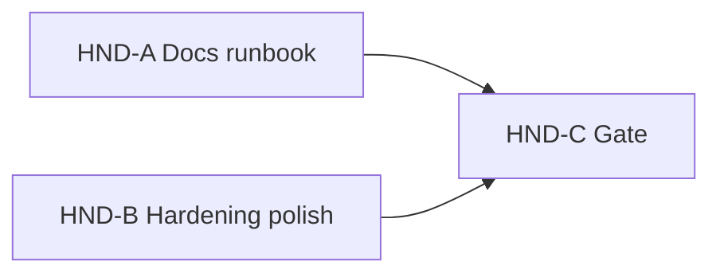

# Phase 11 Hardening / Handoff HND — V1 Evaluation Runbook & Polish

**Status:** DONE (2026-08-26) — HND-A…C accepted; focused HND **8 / 31**; full Docker **493 / 3999**; AR/EN **1141 / 1141**; UAT **25 / 0**; leftovers **0**  
**Authority:** ADR-001, ADR-002, ADR-012, ADR-040, ADR-042; Phase 11 in `docs/development-plan.md`; FR-ADM / commerce V1 already gated via CHK…ADM  
**Baseline:** Phases 1–10 V1 slices DONE (Cart, Checkout, VOL, CAN, Wishlist, Reviews, Coupons, Admin Ops); `DemoMarketplaceSeeder` + `php artisan demo:seed` already ship; README has Docker / Laragon / demo login table / short walkthrough; login throttle exists; product image upload max **5120** KB; S8C EXPLAIN already concluded **no** new catalog index migration without production evidence  
**Related:** Phase 11 handoff for university demo/defense — **does not** open Future F1–F7

Implement only the named slice when asked. Do **not** start card charge, settlement / refund ledger, SMS, store rating productization, vendor review replies, COD collected UI, admin cancel, Redis productization, FULLTEXT search engine, or new commerce features unless a later approved slice says so.

## Planning freeze (APPROVED for HND V1)

| Topic | Decision for HND V1 | Notes |
|-------|---------------------|--------|
| Demo data | **Document + verify only** — do **not** rebuild `DemoMarketplaceSeeder` | Command already refuses production; upserts by stable demo keys. HND confirms README/runbook matches live behavior. |
| README runbook | Expand to a single evaluator-facing path: Docker Compose **and** Laragon; platform seed vs `demo:seed`; demo logins; end-to-end V1 walkthrough; queue/mailpit notes; test commands | Replace Phase-1-only tone; keep concise. |
| Security checklist | Thin markdown checklist in README or `docs/security-checklist.md` (linked from README) | Authz fail-closed, money minors, no public SKU / exact inventory, staff/vendor gates, CSRF, upload types/size, `demo:seed` production refuse, env secrets. No new permission catalog (BR-PERM-07 out). |
| Error pages | Polish **only where missing**: branded/minimal Blade for common HTTP errors (at least **404**, **403**, **419**, **429**, **500**) consistent with storefront chrome | Do not invent an API error framework. |
| Rate limits | Keep existing login throttle; add **thin** extra throttles only if a clear gap exists (e.g. password-reset / public POST abuse) — no Redis-backed rate limiter productization | Prefer Laravel defaults / `RateLimiter` / route `throttle` middleware. |
| Upload limits | Verify + document existing product-image **5 MB** / type rules; fix only if enforcement/docs disagree | No CDN / image pipeline (Future F6). |
| Indexes / query notes | **No speculative index migrations.** Record a short note only if cheap evidence already exists (cite S8C EXPLAIN: no Phase 11 catalog index without production cardinality) | Optional one-paragraph README/`docs` note. Skip new EXPLAIN campaigns unless a known slow path is already failing demos. |
| Queue reliability | Document Compose `queue` worker + `QUEUE_CONNECTION`; verify notifications/jobs remain `ShouldQueue` where already designed; no Horizon / Redis queue productization | Sync/database queue OK for V1 demo. |
| Final regression | Full Docker PHPUnit suite once at HND-C gate | Match project gate discipline. |
| Manual UAT | Short checklist script (markdown) covering the frozen walkthrough paths | Executed at HND-C; leftovers 0. |
| Storage | MySQL authoritative | Redis remains Compose infrastructure only — **not** an application cache/session product feature in HND. |

### Source rules

> 1. Phase 11 delivers a stable demo environment + developer/evaluator docs (`docs/development-plan.md`).  
> 2. Demo marketplace seed already exists — handoff documents and verifies it; does not redesign commerce data.  
> 3. Hardening is gap-fill only (errors, limits, throttle) — not new commerce.  
> 4. Indexes follow evidence (ADR-040 / S8C posture): no migration without proven need.  
> 5. Future F1–F7 (card charge, settlement, SMS, advanced shipping, etc.) stay out.

### Hard out of scope (every slice)

- Card / wallet charge (Future F1)  
- Settlement / refund ledger (Future F2)  
- SMS / richer notification channels (OPEN-013 remainder / F7)  
- Store rating productization; vendor review replies  
- COD collected mutation UI; admin cancel; Parent derivation engine  
- Redis productization (cache/session/queue product feature); Horizon  
- Vendor self-serve coupons; BR-PERM-07 permission matrix UI  
- Rebuild or redesign `DemoMarketplaceSeeder` / new commerce features  
- Speculative DB index migrations without evidence  

## Slice map

| Slice | Primary outcome | Depends on | Status |
|-------|-----------------|------------|--------|
| **HND-A** | Evaluator runbook + security checklist + UAT script draft; demo:seed documented/verified (no seeder rebuild); queue/mail/test commands aligned | This freeze | **DONE** (2026-08-26) — demo:seed verified; README + checklist + UAT draft |
| **HND-B** | Hardening polish: missing error pages; thin rate-limit/upload gap-fill; optional index/query note from existing evidence | HND-A (docs may land first; B may touch README only for limit numbers) | **DONE** (2026-08-26) — focused **8 / 31**; AR/EN **1141 / 1141** |
| **HND-C** | Final gate: full Docker regression; execute brief manual UAT; leftovers 0; mark DONE; Phase 11 note in `docs/development-plan.md` | HND-A, HND-B | **DONE** (2026-08-26) — full Docker **493 / 3999**; UAT **25 / 0**; leftovers **0** |



---

## HND-A — Docs / runbook / checklist

**Status:** DONE (2026-08-26) — `demo:seed` verified (emails/coupons match); no seeder changes  

**Goal:** An evaluator can bring up Docker or Laragon, seed platform + demo data, and walk the V1 story without reading ADRs end-to-end.

**In scope**

1. Expand [`README.md`](../../README.md) into the Phase 11 runbook: Docker Compose path; Laragon/local PHP path; `migrate --seed` vs `demo:seed`; production refuse; demo accounts/coupons; end-to-end walkthrough (browse → cart → coupon → COD place → vendor fulfill → review → cancel/advance as already seeded).  
2. Thin **security checklist** (README section or `docs/security-checklist.md` linked from README).  
3. Draft **manual UAT script** (checklist) for HND-C execution — same walkthrough + staff admin KPI glance + health `/up`.  
4. Document queue worker (Compose), Mailpit, `php artisan test` / Docker test invocation as used by the project.  
5. **Verify** `demo:seed` still matches documented emails/codes (run once in local/Docker; fix README only if drift — **no seeder redesign**).

**Out of scope:** Error-page Blade work (HND-B); full Docker suite (HND-C); commerce features.

**Done when:** README/checklist/UAT draft reviewed against live `demo:seed` output; no seeder rewrite.

**Shipped:** Expanded `README.md`; `docs/security-checklist.md`; `docs/uat-phase-11.md`; live `demo:seed` confirmed (`customer@demo.test` / vendors / `SAVE10` / `SHOPSYP10`).

**Stop after HND-A.**

---

## HND-B — Hardening polish (gap-fill only)

**Status:** DONE (2026-08-26) — focused **8 / 31**; AR/EN **1141 / 1141**  

**Goal:** Missing evaluation polish for errors/limits without new product surface area.

**In scope**

1. Add/customize missing HTTP error views (404 / 403 / 419 / 429 / 500) to match existing brand/layout lightly; AR/EN strings with key parity.  
2. Confirm login throttle; add thin throttles only for clear public abuse gaps.  
3. Confirm product-image upload rules (size/types) match docs; adjust docs or validation only if mismatched.  
4. Optional short “indexes / query” note citing S8C evidence (no new migration unless a concrete demo-breaking query is already identified with EXPLAIN).  
5. Focused HTTP tests for error pages / throttle behavior where practical (keep small).

**Out of scope:** Redis rate-limit store; CDN; speculative indexes; queue Horizon; full suite.

**Done when:** Focused hardening checks green; AR/EN parity for new strings.

**Shipped:** `resources/views/errors/{404,403,419,429,500,layout}`; throttle on password-reset / register / locale; upload max confirmed **5120**; `docs/indexes-query-note.md`; `HardeningHndBTest`.

**Stop after HND-B.**

---

## HND-C — Acceptance gate

**Status:** DONE (2026-08-26)  

**Goal:** Phase 11 handoff accepted for V1 evaluation.

**In scope**

1. Gate: focused HND tests (if any from B); Pint (HND-scoped); `view:cache`; AR/EN parity; forbidden-ref (no card charge, settlement, SMS, store rating, COD collect UI, admin cancel, Redis productization, seeder redesign); **full Docker PHPUnit** once; execute brief manual UAT from HND-A script; leftovers **0**.  
2. Mark this task DONE with exact counts; sync Phase 11 note in [`docs/development-plan.md`](../development-plan.md) (handoff accepted; Future F1+ still out).

**Out of scope:** Starting Future phases; reopening OPEN commerce decisions.

**Done when:** Gate table recorded; UAT leftovers 0; task DONE.

### Gate (HND-C / HND final)

| Check | Result |
|-------|--------|
| Focused HND (`HardeningHndBTest`) | **8 / 31** |
| Pint (HND-scoped PHP: `routes/auth.php`, `routes/web.php`, `tests/Feature/HardeningHndBTest.php`) | **PASS** |
| `view:cache` | **PASS** |
| AR/EN key parity | **1141 / 1141** (missing 0) |
| Forbidden-ref (card charge; settlement ledger; SMS; store rating; COD collect UI; admin cancel; Redis productization; seeder redesign — HND-touched surfaces) | **PASS** |
| Full Docker PHPUnit (`docker compose exec -T app vendor/bin/phpunit --testdox`) | **493 / 3999** |
| Brief UAT ([`docs/uat-phase-11.md`](../uat-phase-11.md) against live demo DB: health, storefront locale/PDP/cart privacy, demo accounts, vendor index, staff KPI/parent/payment/settings/coupons; commerce walkthrough regression-covered by full suite) | **25 / 0** |
| Gate leftovers | **0** |

**Verification (HND-C):** Task **DONE**. Phase 11 handoff accepted in `docs/development-plan.md`. Future F1+ (card charge, settlement ledger, SMS, etc.) remain out. No commerce reopen.

**Stop after HND-C.** (Completed.) Do not start card charge, settlement ledger, or SMS.

---

## Hard boundaries (every slice)

- Document/verify demo seed — never rebuild as a feature.  
- Gap-fill hardening only; no new commerce.  
- No Redis application productization; no speculative indexes.  
- No card charge; settlement; SMS; store rating; COD collect UI; admin cancel.  
- No commit/push unless the user asks.

## Prompts

```text
Implement only HND-A from @docs/tasks/phase-11-hardening-hnd.md. Stop after the runbook, security checklist, and UAT draft are verified against demo:seed.
```

```text
Implement only HND-B from @docs/tasks/phase-11-hardening-hnd.md. Stop after focused hardening checks.
```

```text
Implement only HND-C from @docs/tasks/phase-11-hardening-hnd.md. Stop after the final acceptance report.
```
