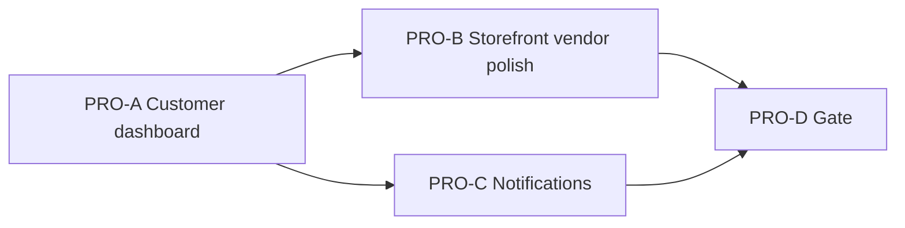

# Professional Polish PRO — Production-Ready Account & Surfaces

**Status:** READY (planning freeze 2026-08-29 — implement only the named slice when asked)  
**Authority:** ADR-001, ADR-002, ADR-012, ADR-042; BR-CUS-02, BR-CUS-06, BR-NTF-01; OPEN-018 (wishlist); checkout/order/wishlist/notification baselines  
**Baseline:** Commerce V1 live — checkout, orders, wishlist, addresses, COL mark-collected; customer `/dashboard` still uses a **Route closure** with placeholder copy (“When checkout launches…”, “Heart a piece…”, hardcoded empty states); trust-strip and vendor dashboard retain “later phase” strings; notifications tray is a visual placeholder  
**Related:** Makes the marketplace feel production-ready without reopening checkout, coupons, shipping rules, F1/F2/F7, or new notification types.

Implement only the named slice when asked. Do **not** start card charge (F1), settlement ledger (F2), SMS (F7), checkout/coupon/shipping recalculation, new notification event types, demo seeder redesign, or full Docker suite unless PRO-D gate says so.

## Planning freeze (APPROVED for PRO V1)

| Topic | Decision for PRO V1 | Notes |
|-------|----------------------|--------|
| PRO-A dashboard | Replace `/dashboard` closure with **`Account\DashboardController`** | Auth required; bounded queries only; **no queries in Blade**. |
| Recent orders | Last **5** own Parent orders for **customers** | Reuse `OrderViewService::parentIndexRows()`; link to `account.orders.show`; empty state when none (live copy, no “checkout launches”). |
| Wishlist card | Live **count** of storefront-visible wishlist items | Reuse `WishlistService` / `WishlistItemPolicy`; match list page visibility rules. |
| Addresses card | Keep existing **`addressCount`** behavior | Already live from ADDR. |
| PRO-B storefront/vendor | Trust-strip + vendor dashboard KPIs | Remove “later phase” / “when commerce opens”; accurate COD + Syria city delivery copy; vendor bounded VO counts with link to `vendor.orders`. |
| PRO-C notifications | Wire database notifications tray | List recent, mark-as-read, empty state; reuse existing `toArray` payloads; **no SMS**, no new types. |
| Presenters | Query-free Blade | All labels/links from controller + `OrderViewService` / services. |
| i18n | AR/EN parity for new strings; PRO-B/D stale-string grep | Remove orphaned keys in PRO-D if unused. |
| Storage | MySQL authoritative | No Redis; no new migrations unless bug found. |

### Source rules

> 1. Customers access only their own orders and wishlist (BR-CUS-06 / FR-RBAC-04).  
> 2. Parent order list presentation already exists on `account.orders` — dashboard reuses the same row shape (bounded).  
> 3. Notifications minimum is mail + database (ADR-042); PRO-C surfaces DB notifications only.  
> 4. Commerce is live — copy must not imply checkout/orders/wishlist are “later phase”.

### Hard out of scope (every slice)

- Card charge / wallet gateways (F1)  
- Settlement, refund, or vendor wallet ledger (F2)  
- SMS or new notification channels/types (F7)  
- Checkout, cart, coupon, or shipping calculator changes  
- New notification event types beyond existing Order/VendorApplication payloads  
- Admin dashboard redesign  
- `DemoMarketplaceSeeder` redesign  
- Redis; Horizon  
- Full Docker suite until **PRO-D** gate  

## Slice map

| Slice | Primary outcome | Depends on | Status |
|-------|-----------------|------------|--------|
| **PRO-A** | Customer dashboard live (CUS-DB): controller, recent orders, wishlist count, stale copy removed | This freeze | DONE |
| **PRO-B** | Storefront trust-strip + vendor dashboard KPI polish; stale-string grep on touched surfaces | PRO-A optional | DONE |
| **PRO-C** | In-app notification center (NTF-lite): DB notifications list + mark read | PRO-A optional | PENDING |
| **PRO-D** | Gate: focused PRO tests; Pint; `view:cache`; AR/EN parity; forbidden-ref; mark DONE | PRO-A, PRO-B, PRO-C | PENDING |



---

## PRO-A — Customer dashboard live (CUS-DB)

**Status:** DONE (2026-08-29) — focused **5 / 5**; AR/EN **1157 / 1157** (2 new keys)

**Goal:** `/dashboard` shows live customer snapshot — recent orders, wishlist count, addresses — without placeholder commerce copy.

**In scope**

1. **`Account\DashboardController`** — single `__invoke` or `index`; auth via existing middleware.  
2. **Replace** `Route::get('/dashboard', closure…)` in `routes/web.php`.  
3. **Recent orders** — `ParentOrder::query()->where('user_id', …)->latest('placed_at')->limit(5)` + `OrderViewService::parentIndexRows()`.  
4. **Wishlist count** — `WishlistService::countFor()` (or equivalent) matching storefront-visible scope; `0` for non-customers.  
5. **`addressCount`** — unchanged semantics for customers.  
6. **`dashboard.blade.php`** — order list with status + link; conditional wishlist/empty states; remove:  
   - `When checkout launches, this becomes a timeline of parent orders.`  
   - `Heart a piece on the storefront to preview this list later.`  
   - Hardcoded `Nothing saved` / `No orders yet` when data exists  
7. **Focused HTTP tests** (`ProfessionalPolishProATest` or `CustomerDashboardProATest`): guest redirect; customer empty dashboard; customer with orders + wishlist count.  
8. **AR/EN** strings for any new empty/helper copy.

**Out of scope:** PRO-B/C/D; vendor dashboard; trust-strip; notifications; full Docker suite.

**Done when:** Focused PRO-A HTTP tests green; dashboard shows live data; stale PRO-A copy removed from dashboard Blade.

**Stop after PRO-A.**

---

## PRO-B — Storefront & vendor polish

**Status:** DONE (2026-08-29) — focused **3 / 3**; AR/EN keys added for trust-strip + vendor KPIs

**Goal:** Storefront trust strip and vendor dashboard reflect live commerce; stale “later phase” copy removed from touched surfaces.

**In scope**

1. **`components/commerce/trust-strip.blade.php`** — replace “Payment stays in a later phase” / “City delivery when commerce opens” with accurate COD + Syria city delivery copy.  
2. **`vendor/dashboard.blade.php`** + **`VendorDashboardController`** (or equivalent) — remove “Catalog and orders arrive in later phases”; add bounded KPI cards (e.g. pending + delivered VO counts, link to `vendor.orders.index`).  
3. **Stale-string grep** on customer/vendor/storefront surfaces touched by PRO — document hits in PRO-D gate; remove from Blade where in scope.  
4. **Focused HTTP tests** for trust-strip presence on storefront + vendor dashboard KPIs.  
5. **AR/EN** strings.

**Out of scope:** PRO-C/D gate; checkout changes; notification center.

**Done when:** Focused PRO-B tests green; no “later phase” on PRO-B-touched Blade surfaces.

**Stop after PRO-B.**

---

## PRO-C — In-app notification center (NTF-lite)

**Status:** PENDING  

**Goal:** Authenticated users see real database notifications in the header tray; mark-as-read works.

**In scope**

1. Wire **`layouts/partials/notifications.blade.php`** to Laravel `DatabaseNotification` for auth user.  
2. **List** recent notifications (bounded, e.g. last 20); **mark-as-read** action (single + optional mark all).  
3. **Empty state** — remove “visual placeholder” copy.  
4. Reuse existing Order / VendorApplication notification **`toArray`** payloads for display; no new notification classes/events.  
5. **Routes/controller** — thin `Account\NotificationController` or shared endpoint.  
6. **Focused HTTP tests** — guest no tray mutation; customer/vendor sees seeded notification; mark read.  

**Out of scope:** SMS; new notification types; email changes; PRO-D gate.

**Done when:** Focused PRO-C HTTP tests green; tray shows live DB notifications.

**Stop after PRO-C.**

---

## PRO-D — Acceptance gate

**Status:** PENDING  

**Goal:** PRO V1 accepted; production polish complete; forbidden surfaces unchanged.

**In scope**

1. Gate: focused PRO tests (A+B+C); Pint (PRO-scoped); `view:cache`; AR/EN parity; **forbidden-ref** — no F1/F2/F7, checkout/coupon/shipping changes, demo seeder redesign on PRO surfaces; stale-string check for PRO-A/B copy targets.  
2. Mark task DONE; optional one-line note in `docs/development-plan.md`.

**Out of scope:** Full Docker suite unless project gate requires it.

**Done when:** Gate table recorded; task DONE.

**Stop after PRO-D.**

---

## Hard boundaries (every slice)

- Bounded queries; no N+1 in dashboard/notifications; no queries in Blade.  
- Customer-owned data only; fail-closed patterns unchanged.  
- No checkout, coupon, shipping, payment gateway, or settlement changes.  
- No F1/F2/F7; no new notification types in PRO-C.  
- No commit/push unless the user asks.

## Existing code anchors (inspect before PRO-A)

| Area | Location |
|------|----------|
| Dashboard route stub | `routes/web.php` — `/dashboard` closure |
| Dashboard view | `resources/views/dashboard.blade.php` |
| Account orders | `app/Http/Controllers/Account/ParentOrderController.php`, `OrderViewService::parentIndexRows()` |
| Wishlist | `app/Http/Controllers/Account/WishlistController.php`, `WishlistService`, `WishlistItemPolicy` |
| Addresses count | `CustomerAddress` model (existing closure logic) |
| Trust strip (PRO-B) | `resources/views/components/commerce/trust-strip.blade.php` |
| Vendor dashboard (PRO-B) | `resources/views/vendor/dashboard.blade.php`, `VendorDashboardController` |
| Notifications (PRO-C) | `resources/views/layouts/partials/notifications.blade.php` |
| Stale copy grep targets | `lang/en.json` keys: `When checkout launches…`, `Heart a piece…`, `Payment stays in a later phase`, `City delivery when commerce opens`, `Your store is live for identity setup. Catalog and orders arrive…`, `No notifications yet. This tray is a visual placeholder.` |

## Prompts

```text
Implement only PRO-A from @docs/tasks/professional-polish-pro.md. Stop after focused PRO-A HTTP tests.
```

```text
Implement only PRO-B from @docs/tasks/professional-polish-pro.md. Stop after focused PRO-B HTTP tests.
```

```text
Implement only PRO-C from @docs/tasks/professional-polish-pro.md. Stop after focused PRO-C HTTP tests.
```

```text
Implement only PRO-D from @docs/tasks/professional-polish-pro.md. Stop after the final acceptance report.
```
